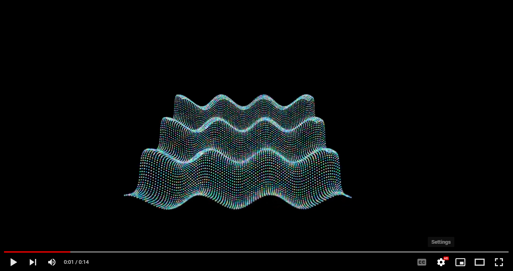
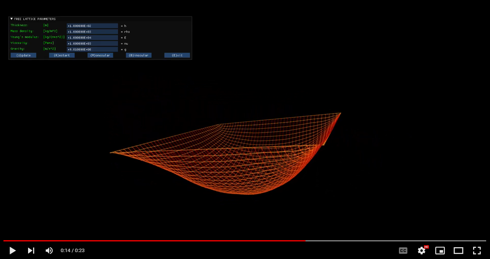
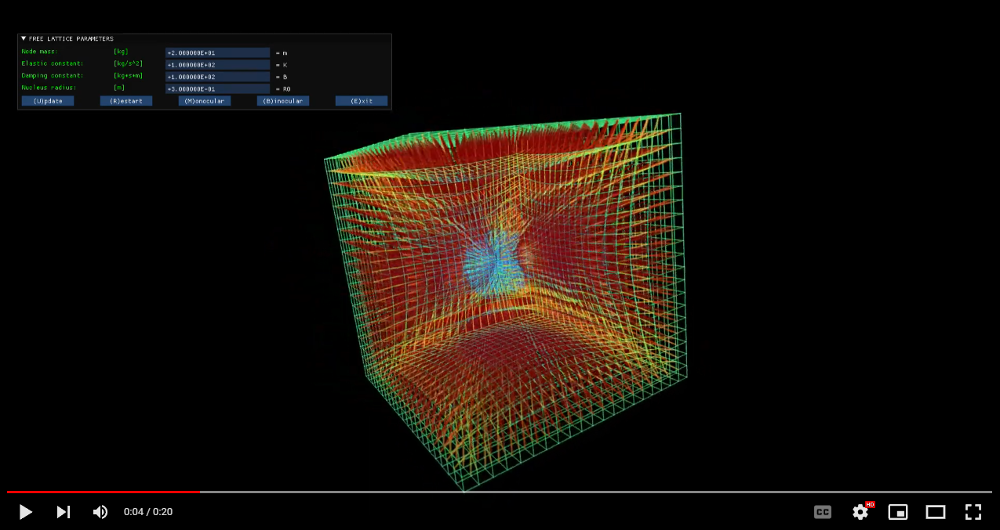
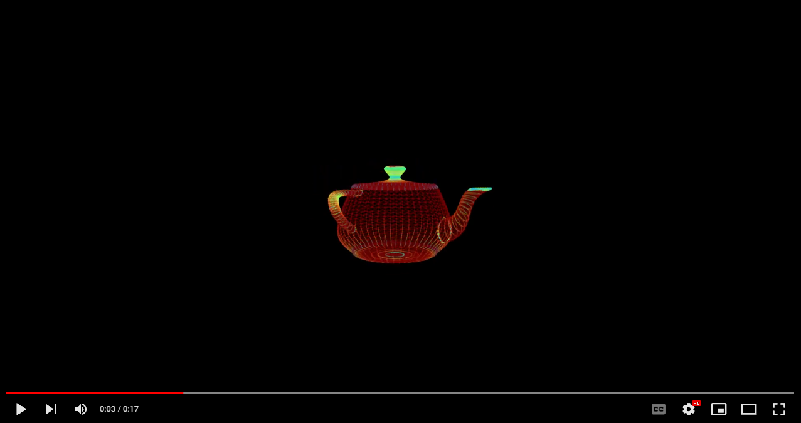

# NEUTRINO EXAMPLES

*A fast and light library for GPU-based computation and interactive data visualization.*

[www.neutrino.codes](https://www.neutrino.codes)

© Alessandro LUCANTONIO, Erik ZORZIN - 2018-2022

# 1. Overview
Neutrino is a C++ library that facilitates writing parallel code running on GPU hardware combining the power of the OpenCL computational framework with the OpenGL graphics language (see https://www.neutrino.codes).

# 2. Toolchain installation

**PLEASE NOTICE THIS INSTALLATION PROCEDURE IS BASED ON THE INSTALLATION OF THE NEUTRINO LIBRARY PRIOR TO IT, HENCE IT SHARES THE SAME HARDWARE AND SOFTWARE REQUIREMENTS. PLEASE CHECK THAT INSTALLATION BY READING THE `README.md` FILE IN THE "NEUTRINO" REPOSITORY: https://github.com/NeutrinoCodes/Neutrino BEFORE PROCEEDING.**

We assume Neutrino is going to be installed in a directory named *NeutrinoCodes* containing the following subdirectories:
`NeutrinoCodes`\
` ├───glad`\
` ├───glfw`\
` ├───gmsh`\
` ├───imgui`\
` ├───implot`\
` ├───libnu`\
` └───neutrino`

# 3. Examples installation
## 3.1 Cloning Examples
From the command shell (either VScode's or system's), navigate into *NeutrinoCodes* and clone the Neutrino project using the command:\
`git clone https://github.com/NeutrinoCodes/examples.git` \
\
This will create the `examples` directory.

At this point you should have this directory structure:\
`NeutrinoCodes`\
` ├───examples`\
` ├───glad`\
` ├───glfw`\
` ├───gmsh`\
` ├───imgui`\
` ├───implot`\
` ├───libnu`\
` └───neutrino`

## 3.2 Configuring Examples on Linux
This can be done either via the system's **command shell** or via **VScode**.

### **Command shell**:
Navigate to the `examples` directory, create a configuration script file called `configure_linux` (e.g. at the command shell type: `touch configure_linux`) and edit it by adding the following command lines:\
`cmake -B"./cmake" -H"./" \`\
`-DGLAD_PATH=your_path_to_glad \`\
`-DGLFW_PATH=your_path_to_glfw \`\
`-DGMSH_PATH=your_path_to_gmsh \`\
`-DCL_PATH=your_path_to_opencl \`\
`-DIMGUI_PATH=your_path_to_imgui \`\
`-DIMPLOT_PATH=your_path_to_implot \`\
`-DNEUTRINO_PATH=your_path_to_neutrino`\
\
and specify the paths accordingly, where:
- *GLAD_PATH* is the path of the root directory of the Glad library: it contains the src and include subdirectories;

- *GLFW_PATH* is the path of the root directory of the Glfw library: it contains the include subdirectory;

- *GMSH_PATH* is the path of the root directory of the Gmsh library: it contains the include and lib subdirectories;

- *CL_PATH* is the path of the root directory of the OpenCL library: it contains the include and lib subdirectories;

- *IMGUI_PATH* is the path of the root directory of the Imgui library: it contains all the .cpp and .h files in
the root directory of the Imgui repository and all imgui_impl_opengl3.* files present in the backends directory (see instructions on its repository);

- *IMPLOT_PATH* is the path of the root directory of the Implot library: it contains all the .cpp and .h files in
the root directory of the Implot repository;

- *NEUTRINO_PATH* is the path of Neutrino's project folder and should be followed by `/libnu`, where the library will be installed.
  
Make the configuration script to be **executable** (at the command shell type: `chmod a+x configure_linux`) and launch it by typing `./configure_linux` at the command shell. The CMake configuration files will be generated.

Enter the cmake directory and type `make install` (use `make clean` to remove old build files if necessary).

### **VScode:**
Alternatively, open a **VScode shell terminal** and go to the `examples` directory, then create a `.vscode` hidden directory:\
`mkdir .vscode`\

Now create a new file `settings.json` in it, then fill it with the following information:\
`{`\
&nbsp;&nbsp;`"cmake.configureSettings":`\
&nbsp;&nbsp;`{`\
&nbsp;&nbsp;&nbsp;&nbsp;`"GLAD_PATH": "your_path_to_NeutrinoCodes/glad",`\
&nbsp;&nbsp;&nbsp;&nbsp;`"GLFW_PATH": "your_path_to_NeutrinoCodes/glfw",`\
&nbsp;&nbsp;&nbsp;&nbsp;`"GMSH_PATH": "your_path_to_NeutrinoCodes/gmsh",`\
&nbsp;&nbsp;&nbsp;&nbsp;`"CL_PATH": "your_path_to_OpenCL",`\
&nbsp;&nbsp;&nbsp;&nbsp;`"IMGUI_PATH": "your_path_to_NeutrinoCodes/imgui",`\
&nbsp;&nbsp;&nbsp;&nbsp;`"IMPLOT_PATH": "your_path_to_NeutrinoCodes/implot",`\
&nbsp;&nbsp;&nbsp;&nbsp;`"NEUTRINO_PATH": "your_path_to_NeutrinoCodes/libnu"`\
&nbsp;&nbsp;`}`\
`}`\
\
and save it.

At this point, Neutrino is configured for your system. 

In VScode, open a folder from the file menu and select NeutrinoCodes. Go to the left bar and locate the **CMake** button (it comes after the installation of the CMake Tools extension for VScode) and push it: a CMake panel will open, push the **Configure All Projects** button on it.

Go to the bottom bar and locate:
- the **Build variant** button: verify it has been selected to **[Release]**.
- the **Active kit** button: verify it has been selected according to your system's characteristics. e.g. **[Visual Studio Community 2022 Release - amd64]**.
- the **Target** button: verify it has been selected to **[install]**.
- the **Build** button: push it in order to build the Neutrino project.

**You are done! Neutrino as been fully installed and configured on your Linux system!**

## 3.3 Configuring Neutrino on Windows
This can be done either via **Visual Studio** or via **VScode**.

**Notice**, as opposed to Linux, that for the configuration of Neutrino on Windows **all paths must be specificed with *double backslashes*, in order to correctly manage the possibility of space characters in the them**.
e.g. `your_path_to_OpenCL` might be something like this (it depends on your GPU's graphics drivers):\
`C:\\Program Files\\NVIDIA GPU Computing Toolkit\\CUDA\\v11.5`

### **Visual Studio**:
Go to the `examples` directory: create and edit a `CMakeSettings.json` file in it, then fill it with the following information:\
`{`\
&nbsp;&nbsp;`"configurations": [`\
&nbsp;&nbsp;&nbsp;&nbsp;`{`\
&nbsp;&nbsp;&nbsp;&nbsp;&nbsp;&nbsp;`"name": "x64-Release",`\
&nbsp;&nbsp;&nbsp;&nbsp;&nbsp;&nbsp;`"generator": "Ninja",`\
&nbsp;&nbsp;&nbsp;&nbsp;&nbsp;&nbsp;`"configurationType": "Release",`\
&nbsp;&nbsp;&nbsp;&nbsp;&nbsp;&nbsp;`"buildRoot": "${projectDir}\\build\\cmake\\${name}",`\
&nbsp;&nbsp;&nbsp;&nbsp;&nbsp;&nbsp;`"installRoot": "${projectDir}\\out\\install\\${name}",`\
&nbsp;&nbsp;&nbsp;&nbsp;&nbsp;&nbsp;`"cmakeCommandArgs": "-DGLAD_PATH=\"your_path_to_NeutrinoCodes\\glad\" -DGLFW_PATH=\"your_path_to_NeutrinoCodes\\glfw\" -DGMSH_PATH=\"your_path_to_NeutrinoCodes\\gmsh\" -DCL_PATH=\"your_path_to_OpenCL\\opencl\" -DIMGUI_PATH=\"your_path_to_NeutrinoCodes\\imgui" -DIMPLOT_PATH=\"your_path_to_NeutrinoCodes\\implot" -DNEUTRINO_PATH=\"your_path_to_NeutrinoCodes\\libnu\"",`\
&nbsp;&nbsp;&nbsp;&nbsp;&nbsp;&nbsp;`"buildCommandArgs": "",`\
&nbsp;&nbsp;&nbsp;&nbsp;&nbsp;&nbsp;`"ctestCommandArgs": "",`\
&nbsp;&nbsp;&nbsp;&nbsp;&nbsp;&nbsp;`"inheritEnvironments": [ "msvc_x64_x64" ]`\
&nbsp;&nbsp;&nbsp;&nbsp;&nbsp;&nbsp;`"variables": [ "msvc_x64_x64" ]`\
&nbsp;&nbsp;&nbsp;&nbsp;`}`\
&nbsp;&nbsp;`]`\
`}`\
\
and save it.

Notice the long lines in the  `CMakeSettings.json` file **cannot be broken** in multiple lines.

Alternatively, the same file can edited within Visual Studio by right-clicking the CMakeLists.txt file in the Solution Explorer - Folder View and then selecting the **CMake Settings for 'project_name'** button. This will open the CMake Settings editor. The string to be edited, containing all user's paths, is the one in the **CMake command arguments** text field.

Then in Visual Studio, **open a folder** from the file menu and select NeutrinoCodes. Visual Studio will invoke Cmake. After it finished configuring the project, go to the Build menu and push the **Build** button. Once the Neutrino library has been built, it has to be installed: to do so, go to the Build menu and push the **Install** button.

### **VScode**:
Go to the `examples` directory and create a `.vscode` hidden directory:\
`mkdir .vscode`\
\
and create a new file `settings.json` in it, then fill it with the following information:\
`{`\
&nbsp;&nbsp;`"cmake.configureSettings":`\
&nbsp;&nbsp;`{`\
&nbsp;&nbsp;&nbsp;&nbsp;`"GLAD_PATH": "your_path_to_NeutrinoCodes\\glad",`\
&nbsp;&nbsp;&nbsp;&nbsp;`"GLFW_PATH": "your_path_to_NeutrinoCodes\\glfw",`\
&nbsp;&nbsp;&nbsp;&nbsp;`"GMSH_PATH": "your_path_to_NeutrinoCodes\\gmsh",`\
&nbsp;&nbsp;&nbsp;&nbsp;`"CL_PATH": "your_path_to_OpenCL",`\
&nbsp;&nbsp;&nbsp;&nbsp;`"IMGUI_PATH": "your_path_to_NeutrinoCodes\\imgui",`\
&nbsp;&nbsp;&nbsp;&nbsp;`"IMPLOT_PATH": "your_path_to_NeutrinoCodes\\implot",`\
&nbsp;&nbsp;&nbsp;&nbsp;`"NEUTRINO_PATH": "your_path_to_NeutrinoCodes\\libnu"`\
&nbsp;&nbsp;`}`\
`}`\
\
and save it.

Then in VScode, open a folder from the file menu and select NeutrinoCodes. Go to the left bar and locate the **CMake** button (it comes after the installation of the CMake Tools extension for VScode) and push it: a CMake panel will open, push the **Configure All Projects** button on it.

Go to the bottom bar and locate:
- the **Build variant** button: verify it has been selected to **[Release]**.
- the **Active kit** button: verify it has been selected according to your system's characteristics. e.g. **[Visual Studio Community 2022 Release - amd64]**.
- the **Target** button: verify it has been selected to **[install]**.
- the **Build** button: push it in order to build the Neutrino project.

**You are done! Neutrino as been fully installed and configured on your Windows system!**

# 4. Uncrustify configuration
We all like tidy code! For this, we provide an **Uncrustify** (sources: https://github.com/uncrustify/uncrustify) configuration file specific for Neutrino to be used in VScode. In order to use it, please first install Uncrustify according to your operating system, then install the VScode's *Uncrustify extension* (https://marketplace.visualstudio.com/items?itemName=zachflower.uncrustify).

- On Linux:
Add the following lines to either the *global* or *project* **settings.json** file:
`"uncrustify.executablePath.linux": "your_path_to_uncrustify",`\
`"editor.defaultFormatter": "zachflower.uncrustify",`\
`"editor.formatOnSave": true`

- On Windows:
Add the following lines to either the *global* or *project* **settings.json** file:
`"uncrustify.executablePath.windows": "your_path_to_uncrustify",`\
`"editor.defaultFormatter": "zachflower.uncrustify",`\
`"editor.formatOnSave": true`

To edit the *global* settings, on VScode go to the left bar: push the **Extensions** button and select the Uncrustify extension. Then go to **Manage --> Extension Settings** (gear-like icon) and edit the `settings.json` file by clicking one of the links in that section. This will set the Uncrustify code formatter globally in all your VScode projects (but still with per-project custom uncrustify configuration files).\
\
To edit the *project* settings, open `settings.json` file in the `.vscode` you created for Neutrino (the hidden directory inside the `examples` directory) and put the same lines in it. This will set Uncrustify as code formatter (together with the configuration file we provide) only for the Neutrino project.

© Alessandro LUCANTONIO, Erik ZORZIN - 2018-2022